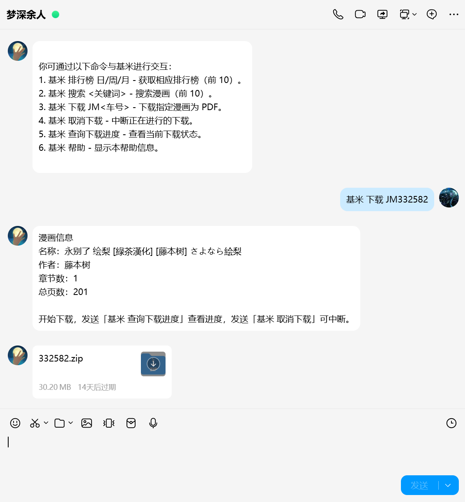
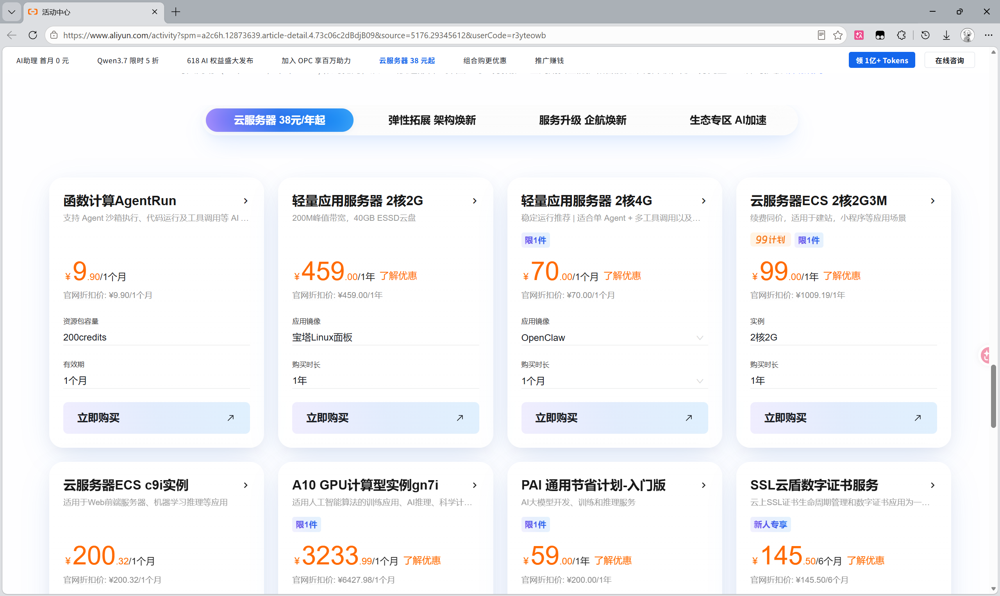
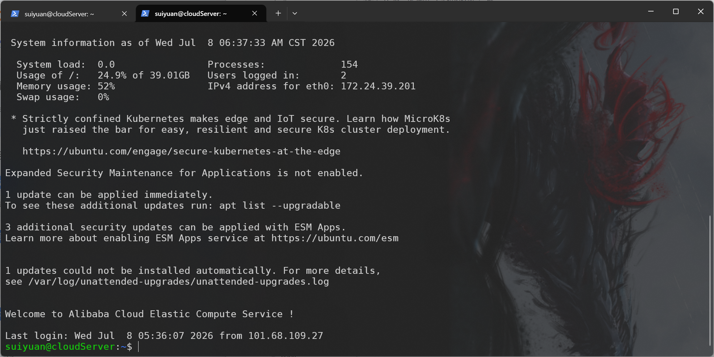
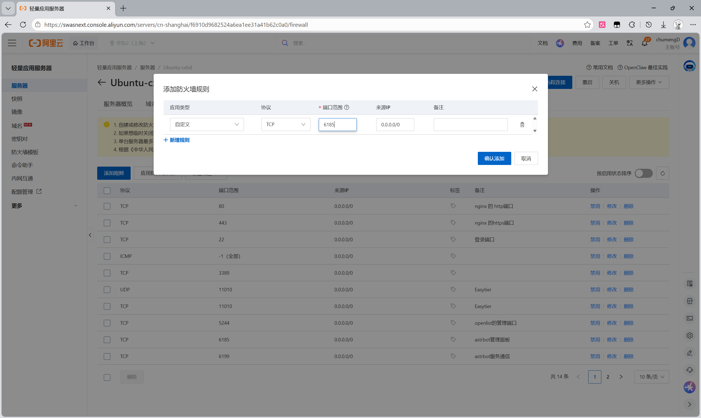
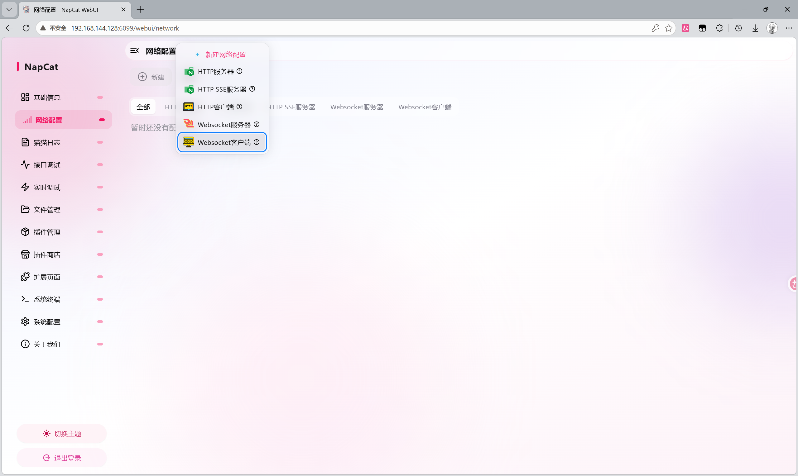
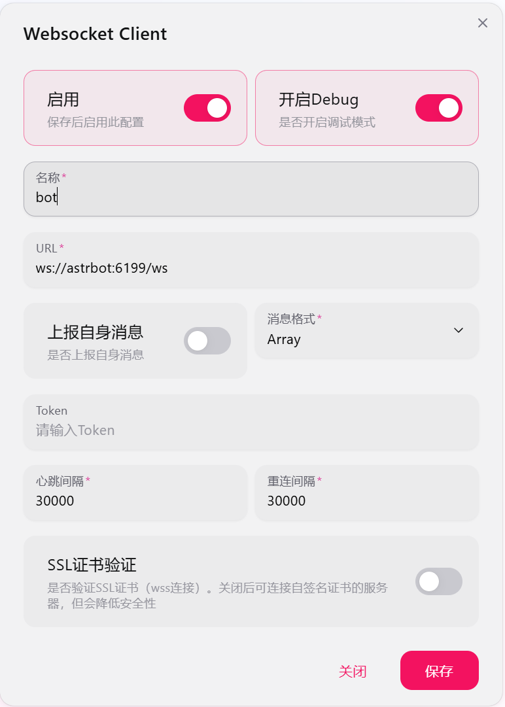
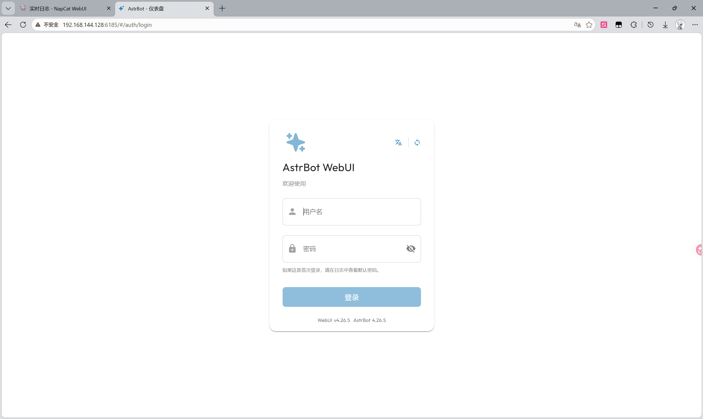
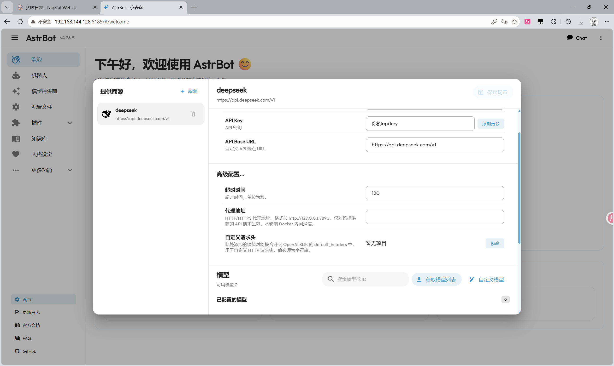

# 如何在云服务器用 AstrBot + NapCat + JMComic 部署一个漫画下载器

## 前言

谁又能拒绝搭建一个可以提醒、打卡、聊天，又能当资源下载器的 QQ 机器人呢？

当然前面几个特性不是今天的重点，今天的重点是如何写一个 AstrBot 插件，让 AstrBot 能搜索、下载 JM 里面的漫画。感谢 [jmcomic](https://github.com/hect0x7/JMComic-Crawler-Python) 库的开发者们。该 Blog 面向几乎零基础的童鞋。

效果展示：



## 前提

要部署这样一个机器人，你需要：

- [ ] 有一个给机器人用的 QQ 号
- [ ] 租一台云服务器（也可以用自己的电脑，不过需要电脑一直开机才能让机器人不掉线）
- [ ] 有一个大模型的 API，推荐 DeepSeek
- [ ] 使用 SSH 远程连接服务器
- [ ] 安装 Docker
- [ ] 在 Docker 上部署 AstrBot 与 NapCat
- [ ] 分别在 AstrBot 与 NapCat 的 WebUI 上配置好机器人
- [ ] 用 AI 写一个 AstrBot 插件（或者直接用我的插件）

## 第一步：租一台服务器

这里以阿里云为例。

进入 [活动中心](https://www.aliyun.com/activity?spm=a2c6h.12873639.article-detail.4.73c06c2dBdjB09&source=5176.29345612&userCode=r3yteowb)，往下滑动，找到【轻量应用服务器】，一般 2G2核 就够用了。不管你买的是 38、68 还是 99 的都行，记得 **安装 Ubuntu**，不要选择什么宝塔之类的容器模板。



购买完成后进入 [活动中心](https://www.aliyun.com/activity?spm=a2c6h.12873639.article-detail.4.73c06c2dBdjB09&source=5176.29345612&userCode=r3yteowb) 左上角的【控制台】，在【我的资源】里点击【计算】里的【轻量应用服务器】。在这里可以看到你的服务器相关信息，点击远程连接里的 Workbench 连接可以连接服务器。

## 第二步：使用 SSH 连接服务器

打开电脑终端，Win11 按 `Win + X` 会弹出选项栏，点击终端，即可进入命令行。

### 1. 生成 SSH 密钥

输入：

```bash
ssh-keygen -t ed25519 -C "你的邮箱@example.com"
```

一直按 Enter。

**结束后**，在命令行的输出里找到如下类似信息：

```
Your public key has been saved in C:\Users\LENOVO\.ssh\id_ed25519.pub
```

用**记事本**打开 `C:\Users\LENOVO\.ssh\id_ed25519.pub` 文件，复制这个**公钥**的内容。

### 2. 将公钥添加到服务器

在阿里云的**控制台**用 Workbench 连接服务器。

在**命令行**输入：

```bash
nano ~/.ssh/authorized_keys
```

在打开的页面里将刚才复制的内容，即**公钥**粘贴进去。

然后按 `Ctrl + O`，**回车**，再 `Ctrl + X` 即可。

### 3. 连接服务器

返回电脑的命令行，输入：

```bash
ssh admin@云服务器的公网IP
```

初次登录需要先输入一次 `yes`。

然后重新输入一遍 `ssh admin@云服务器的公网IP` 就行，显示如下信息即表示连接成功：



## 第三步：安装 Docker

在远程连接了云服务器的**本地命令行**里，依次输入（这里或许会要求你输入用户密码，可在阿里云的控制台里设置这个密码）：

```bash
sudo curl -fsSL https://mirrors.aliyun.com/docker-ce/linux/$(. /etc/os-release && echo "$ID")/gpg -o /etc/apt/keyrings/docker.asc
```

```bash
sudo chmod a+r /etc/apt/keyrings/docker.asc
```

```bash
echo "deb [arch=$(dpkg --print-architecture) signed-by=/etc/apt/keyrings/docker.asc] https://mirrors.aliyun.com/docker-ce/linux/$(. /etc/os-release && echo "$ID") \
  $(. /etc/os-release && echo "$VERSION_CODENAME") stable" | \
  sudo tee /etc/apt/sources.list.d/docker.list > /dev/null
```

```bash
sudo apt-get update
```

```bash
sudo apt-get install docker-ce docker-ce-cli containerd.io docker-buildx-plugin docker-compose-plugin
```

输入 `docker info` 与 `docker compose --version`，没有报错就安装成功了。

## 第四步：部署 AstrBot 与 NapCat

首先，在阿里云的服务器控制台里，点击服务器（名字一般是 `Ubuntu-cxhd`）后，进入【安全组】→【添加规则】，如下图分别添加 **6185、6199、3001、6099** 共四个端口：



然后，返回到**本地命令行**（注意，下文的本地命令行均指**连接了服务器的命令行**），连接上服务器后，输入：

```bash
cd ~
```

```bash
mkdir -p ./share_data napcat/config napcat/qq astrbot_data
```

```bash
chmod 777 ./shared_data
```

```bash
nano docker-compose.yml
```

将以下内容复制进 `docker-compose.yml`，然后 `Ctrl + O`，回车，`Ctrl + X`。

::: warning 注意
如果你的用户不是 `admin`，需要将下列的 `admin` 改为你的用户名。
:::

```yaml
version: '3.8'

services:
  napcat:
    image: m.daocloud.io/docker.io/mlikiowa/napcat-docker:latest
    container_name: napcat
    restart: always
    environment:
      - ACCOUNT=639744881
      - WS_ENABLE=true
    volumes:
      - /home/admin/napcat/config:/app/napcat/config
      - /home/admin/napcat/qq:/app/.config/QQ
      - /home/admin/shared_data:/shared_data
    ports:
      - "3001:3001"
      - "6099:6099"
  astrbot:
    image: m.daocloud.io/docker.io/soulter/astrbot:latest
    container_name: astrbot
    restart: always
    depends_on:
      - napcat
    volumes:
      - /home/admin/astrbot_data:/AstrBot/data
      - /home/admin/shared_data:/shared_data
    ports:
      - "6185:6185"
      - "6199:6199"
```

最后输入：

```bash
sudo docker compose up -d
```

### 接下来配置 NapCat 和 AstrBot

#### NapCat

在命令行输入：

```bash
sudo docker logs -f napcat
```

会弹出一个（或多个）QQ 登录二维码，往上滑动，在**第一个** QQ 二维码的**上方**有一条信息：

```text
07-08 07:42:29 [info] [NapCat] [WebUi] WebUi User Panel Url: http://127.0.0.1:6099/webui?token=7f785aef76ec
```

复制这里面的 token，在我这里即是 `7f785aef76ec`。

接下来随便打开一个浏览器，在网址栏输入：

```
http://你的服务器公网IP:6099
```

例如：`http://101.133.131.100:6099`

这时会进入一个 NapCat 的登录页面，将刚才**复制的 token** 粘贴进去就能登录。


进入之后，点击左边栏【网络配置】，再点击左上角【新建】，选择【WebSocket 客户端】：



如图填写信息并保存：



#### AstrBot

输入：

```bash
sudo docker logs -f astrbot
```

找到如下类型信息（注意，每个人的日志不一样，Blog 里面账号密码对你无用）：

```text
 ✨✨✨
  AstrBot v4.26.5 WebUI is ready
   ➜  Local: http://localhost:6185
   ➜  Network: http://127.0.0.1:6185
   ➜  Network: http://172.18.0.3:6185
   ➜  Initial username: astrbot
   ➜  Initial password: iAVcm7e1LmEbw6UepdPbdHUc
   ➜  Change it after logging in
 ✨✨✨
```

在浏览器的网址栏输入：

```
http://你的服务器公网IP:6185
```

进入如下页面：



将上面**日志信息**里的 `Initial username` 和 `Initial password` 分别复制进登录页面。

登录后，在快速引导里面配置 AI 模型，输入 API Key 后点击**下方获取模型列表**，选择想用的模型：



配置平台机器人，选择 **OneBot v11**，不用配置，直接点击保存。

然后用另一个 QQ 给被 NapCat 登录的 QQ 发送一条信息，在 NapCat 的 WebUI 里面的**猫猫日志**里能接收与发送信息即为配置成功：


## 第五步：编写 AstrBot 插件，实现漫画下载

以下是我的插件，安装好后，向机器人提问 **「基米 帮助」** 可获取使用方法。如果你觉得哪里需要更改，可以直接去问 AI，或者自己改。接下来讲讲怎么安装插件。

依次输入：

```bash
cd ~
```

```bash
sudo mkdir astrbot_data/plugins/jm_downloader
```

```bash
sudo nano astrbot_data/plugins/jm_downloader/main.py
```

将下载的代码完整粘贴进去，然后 `Ctrl + O`，回车，`Ctrl + X` 退出。

```bash
sudo docker exec -it astrbot bash
```

```bash
pip install jmcomic -U
```

```bash
pip install img2pdf
```

```bash
exit
```

```bash
sudo docker restart astrbot
```

等待重启。这时应该已经完成，可以用以下命令查看日志：

```bash
sudo docker logs -f astrbot
```

如果没有报错且出现以下信息即成功：

```text
[06:47:57.555] [Core] [INFO] [star.star_manager:1162]: Plugin JM_Downloader (1.0.0) by chumengD: 监听 基米 关键字,下载本子
```

### 插件代码

::: details 点击展开插件代码

```python
import asyncio
import threading
import os
import re

from astrbot.api.all import *
from astrbot.api.message_components import Node, Plain, Image, File as CompFile
import jmcomic
from jmcomic import JmOption, JmMagicConstants, Feature
from jmcomic.jm_async_downloader import JmAsyncDownloader
from jmcomic.jm_entity import JmAlbumDetail, JmPhotoDetail, JmImageDetail

# ============================================================
# 常量
# ============================================================
CACHE_DIR = os.path.abspath("data/JM_downloads/cache")
DOWNLOAD_DIR = "/shared_data/JM_downloads"
CLEANUP_DELAY = 600  # 10 分钟


def schedule_cleanup(file_path: str, delay_seconds: int = CLEANUP_DELAY):
    """在 delay_seconds 秒后删除指定文件（守护线程，不阻塞主流程）"""
    def _del():
        import time
        time.sleep(delay_seconds)
        try:
            if os.path.exists(file_path):
                os.remove(file_path)
        except Exception:
            pass

    t = threading.Thread(target=_del, daemon=True)
    t.start()


# ============================================================
# 下载进度追踪
# ============================================================
class DownloadProgress:
    """单个下载任务的进度状态"""
    __slots__ = ('album_id', 'album_name', 'total_photos', 'total_pages',
                 'done_photos', 'current_photo_name', 'current_image', 'status')

    def __init__(self, album_id: str, album_name: str, total_photos: int, total_pages: int):
        self.album_id = album_id
        self.album_name = album_name
        self.total_photos = total_photos
        self.total_pages = total_pages
        self.done_photos = 0
        self.current_photo_name = ""
        self.current_image = 0
        self.status = "downloading"  # downloading | converting | done | cancelled | error

    def summary(self) -> str:
        if self.status == "done":
            return f"✅ JM{self.album_id} 下载完成：{self.album_name}"
        if self.status == "cancelled":
            return f"❌ JM{self.album_id} 已取消：{self.album_name}"
        if self.status == "converting":
            return f"🔄 JM{self.album_id} 正在生成 PDF：{self.album_name}"
        if self.status == "error":
            return f"⚠️ JM{self.album_id} 下载出错：{self.album_name}"
        return (
            f"📥 JM{self.album_id} 下载中：{self.album_name}\n"
            f"章节进度：{self.done_photos}/{self.total_photos}\n"
            f"当前章节：{self.current_photo_name}"
        )


class ProgressAsyncDownloader(JmAsyncDownloader):
    """带进度回调的异步下载器，覆写 JmAsyncDownloader 的钩子"""
    progress = None  # type: DownloadProgress | None
    html_cl = None   # 用于获取准确的 page_count

    async def before_photo(self, photo: JmPhotoDetail):
        if self.progress:
            self.progress.current_photo_name = photo.name
            self.progress.current_image = 0
        await super().before_photo(photo)

    async def after_photo(self, photo: JmPhotoDetail):
        if self.progress:
            self.progress.done_photos += 1
        await super().after_photo(photo)

    async def download_album(self, album_id):
        """覆写：用 HTML 客户端获取真实的 page_count，再交给异步下载"""
        if self.progress and self.html_cl:
            try:
                album = self.html_cl.get_album_detail(album_id)
                self.progress.total_pages = album.page_count
                self.progress.total_photos = len(album)
            except Exception:
                pass  # 获取失败则保持 progress 中的初始值
        return await super().download_album(album_id)

    async def after_image(self, image: JmImageDetail, img_save_path: str):
        if self.progress:
            self.progress.current_image += 1
        await super().after_image(image, img_save_path)

    async def after_album(self, album: JmAlbumDetail):
        if self.progress:
            self.progress.status = "converting"
        await super().after_album(album)
        if self.progress:
            self.progress.status = "done"


# ============================================================
# 插件主体
# ============================================================
@register("JM_Downloader", "chumengD", "监听 基米 关键字,下载本子", "1.0.0")
class JMKeywordPlugin(Star):
    def __init__(self, context: Context):
        super().__init__(context)
        self.base_download_dir = DOWNLOAD_DIR
        os.makedirs(self.base_download_dir, exist_ok=True)
        os.makedirs(CACHE_DIR, exist_ok=True)
        self.cl = JmOption.default().new_jm_client()
        self.html_cl = JmOption.default().new_jm_client(impl='html')  # 用于获取准确的 page_count
        # 下载任务管理（同时只允许一个下载）
        self._download_task: asyncio.Task | None = None
        self._download_progress: DownloadProgress | None = None
        self._current_id: str | None = None

    @event_message_type(EventMessageType.ALL)
    async def handle_keyword_trigger(self, event: AstrMessageEvent):
        user_text = event.message_str

        is_boot = re.match(r"^基米", user_text, re.IGNORECASE)
        if not is_boot:
            return

        args = re.match(r"^基米 (帮助|排行榜|搜索|取消下载|查询下载进度|下载)", user_text, re.IGNORECASE)
        if not args:
            return

        command = args.group(1)
        self_id = event.get_self_id()
        self_name = "JM漫画助手"

        match command:
            case "帮助":
                yield event.plain_result("""
你可通过以下命令与基米进行交互：
1. 基米 排行榜 日/周/月 - 获取相应排行榜（前 10）。
2. 基米 搜索 <关键词> - 搜索漫画（前 10）。
3. 基米 下载 JM<车号> - 下载指定漫画为 PDF。
4. 基米 取消下载 - 中断正在进行的下载。
5. 基米 查询下载进度 - 查看当前下载状态。
6. 基米 帮助 - 显示本帮助信息。
                """)
                return

            case "排行榜":
                period_args = re.match(r"^基米 排行榜 (日|周|月)", user_text, re.IGNORECASE)
                if not period_args:
                    yield event.plain_result("请指定排行榜周期：日、周或月。例如：基米 排行榜 日")
                    return

                period = period_args.group(1)

                try:
                    if period == "日":
                        page = self.cl.day_ranking(page=1)
                    elif period == "周":
                        page = self.cl.week_ranking(page=1)
                    else:
                        page = self.cl.month_ranking(page=1)

                    if not page or len(page) == 0:
                        yield event.plain_result(f"未能获取到【{period}】排行榜数据，可能是网络波动，请稍后再试。")
                        return

                    content =[]
                    for i, (album_id, title) in enumerate(page):
                        if i >= 10:
                            break
                        try:
                            cover_path = os.path.join(CACHE_DIR, f"{album_id}.jpg")
                            self.cl.download_album_cover(album_id, cover_path)
                            schedule_cleanup(cover_path)

                            content.append(Plain(f"{i+1}.[JM{album_id}] {title}"))
                            content.append(Image.fromFileSystem(cover_path))
                            content.append(Plain("\n\n"))


                        except Exception:
                            content.append(Plain(f"{i+1}. [JM{album_id}] {title}\n（封面获取失败）\n\n"))

                    node = Node(
                        uin=self_id,
                        name=self_name,
                        content=content)
                    yield event.chain_result([node])

                except Exception as e:
                    yield event.plain_result(f"获取排行榜时发生错误: {str(e)}")

            case "搜索":
                search_args = re.match(r"^基米 搜索 (.+)", user_text, re.IGNORECASE)
                if not search_args:
                    yield event.plain_result("请输入搜索关键词。例如：基米 搜索 雪女")
                    return

                search_term = search_args.group(1).strip()

                try:
                    page = self.cl.search_site(search_term, page=1)

                    if not page or len(page) == 0:
                        yield event.plain_result(f"未搜索到与「{search_term}」相关的结果。")
                        return

                    content=[]
                    for i, (album_id, title) in enumerate(page):
                        if i >= 10:
                            break
                        try:
                            cover_path = os.path.join(CACHE_DIR, f"{album_id}.jpg")
                            self.cl.download_album_cover(album_id, cover_path)
                            schedule_cleanup(cover_path)

                            content.append(Plain(f"{i+1}.[JM{album_id}] {title}"))
                            content.append(Image.fromFileSystem(cover_path))
                            content.append(Plain("\n\n"))


                        except Exception:
                            content.append(Plain(f"{i+1}. [JM{album_id}] {title}\n（封面获取失败）\n\n"))

                    node = Node(
                        uin=self_id,
                        name=self_name,
                        content=content)
                    yield event.chain_result([node])

                except Exception as e:
                    yield event.plain_result(f"搜索时发生错误: {str(e)}")

            case "下载":
                dl_args = re.match(r"^基米 下载 JM(\d+)", user_text, re.IGNORECASE)
                if not dl_args:
                    yield event.plain_result("请指定要下载的JM号。例如：基米 下载 JM123456")
                    return

                album_id = dl_args.group(1)

                # 同时只允许一个下载任务
                if self._download_task is not None and not self._download_task.done():
                    yield event.plain_result(
                        f"当前正在下载 JM{self._current_id}，"
                        f"请等待完成或发送「基米 取消下载」中断后再试。"
                    )
                    return

                try:
                    album = self.html_cl.get_album_detail(album_id)
                    total_photos = len(album)
                    total_pages = album.page_count

                    # 超过 300 页禁止下载
                    if total_pages > 300:
                        yield event.plain_result(
                            f"JM{album_id} 共 {total_pages} 页，超过 300 页限制，不予下载。"
                        )
                        return

                    yield event.plain_result(
                        f"漫画信息\n"
                        f"名称：{album.name}\n"
                        f"作者：{album.author}\n"
                        f"章节数：{total_photos}\n"
                        f"总页数：{total_pages}\n\n"
                        f"开始下载，发送「基米 查询下载进度」查看进度，"
                        f"发送「基米 取消下载」可中断。"
                    )

                    self._current_id = album_id
                    self._download_progress = DownloadProgress(album_id, album.name, total_photos, total_pages)
                    self._download_task = asyncio.create_task(
                        self._run_download(album_id, self._download_progress)
                    )

                    await self._download_task

                    pdf_path = os.path.join(DOWNLOAD_DIR, f"{album_id}.pdf")
                    schedule_cleanup(pdf_path)

                    chain = [
                        CompFile(name=f"{album_id}.pdf", file=f"file:///{pdf_path}"),
                    ]
                    yield event.chain_result(chain)

                except asyncio.CancelledError:
                    yield event.plain_result(f"JM{album_id} 下载已取消。")
                except Exception as e:
                    yield event.plain_result(f"下载 JM{album_id} 时发生错误: {str(e)}")
                finally:
                    self._download_task = None
                    self._download_progress = None
                    self._current_id = None

            case "取消下载":
                if self._download_task is None or self._download_task.done():
                    yield event.plain_result("当前没有正在进行的下载任务。")
                    return

                self._download_task.cancel()
                if self._download_progress:
                    self._download_progress.status = "cancelled"
                yield event.plain_result(f"正在取消 JM{self._current_id} 的下载...")

            case "查询下载进度":
                if self._download_task is None or self._download_task.done():
                    yield event.plain_result("当前没有正在进行的下载任务。")
                    return

                yield event.plain_result(self._download_progress.summary())

    async def _run_download(self, album_id: str, progress: DownloadProgress):
        """在独立的 asyncio Task 中执行下载，支持取消"""
        option = JmOption.default()
        dler = ProgressAsyncDownloader(option)
        dler.progress = progress
        dler.html_cl = self.html_cl
        dler.add_features(Feature.export_pdf(
            pdf_dir=DOWNLOAD_DIR,
            filename_rule='Aid',
            delete_original_file=True,
        ), 'download_album')

        async with dler:
            await dler.download_album(album_id)
```

:::
